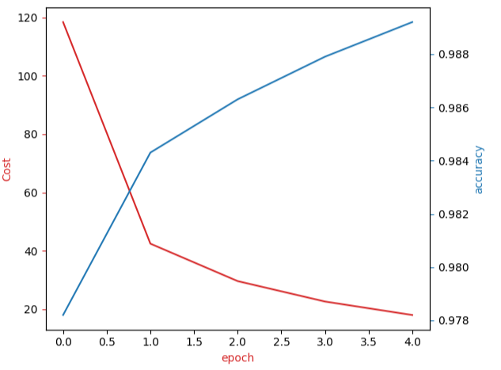

# MNISTClassification
 classify Fashion-MNIST dataset using convolutional neural networks.   
 1: Create a Dataset Class Define Softmax, Criterion function, Optimizer and Train the Model
 2: Create a Convolutional Neural Network class using ONE of the following constructors
3: plot the Cost and accuracy for each epoch for the training and testing data, respectively
 
